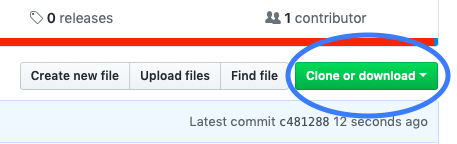

```{r setup, include=FALSE}
knitr::opts_chunk$set(echo = TRUE)
```
##Welcome!

September 9th, 2019

Location: Dorothy Hodgkin 0.31

Morning Session 1000-1230(ish) <br>
Afternoon Session 1345-1630(ish)

<br>

##Before the Workshop - Installing R and RStudio

You will probably want to bring a laptop for this course.  Beforehand, you should install R (the language) and RStudio (the interface that helps us interact with R) - each is available for OSX, Windows, and various flavours of Unix. You can install R from here:

https://www.stats.bris.ac.uk/R/

And RStudio from here:

https://www.rstudio.com/products/rstudio/download/#download

<br>

##Download The Course Material

In advance of the course, you can download the course content by clicking on the "Clone or download" buton on my GitHub page and then selecting "Download ZIP". 

https://github.com/ajstewartlang/Keele_Sept_2019




<br>
Here you'll find separate Morning and Afternoon folders.  The Morning and Afternoon folders contain the slides, and data I use in the slides. Additionally, you'll also find a _Cheat Sheets and Handy Guides_ folder which contains a number of helpful reference resources, and a Quick Start guide to begin working with R.

In the morning we'll cover the basics of R, data wrangling, and data visualisation. In the afternoon we'll look at some standard methods using the general lienar model.  This introductory workship will provide you with the skills needed to start working with R, the RStudio environment, and some basic statistical models.

<br>

##View The Course Material

###Morning Session

You can see the slides for the morning session here:

And the first Worksheet here:

http://ajstewartlang.github.io/Keele_2019/worksheets/worksheet1.html

###Afternoon Session

You can see the slides for the afternoon session here.

And the second Worksheet here:

http://ajstewartlang.github.io/Keele_2019/worksheets/worksheet2.html

<br>

##Online R Resources

Below are some helpful R resources - it would be useful to look at the first one before the initial workshop.
<br><br>

#####Online introductory guide to R, RStudio, and R Markdown.
This is a very clear and focused introduction to R, RStudio, and R Markdown.  You probably want to read the first four chapters sooner rather than later...

http://rbasics.netlify.com

<br>

#####R for Data Science online book - Garrett Grolemund and Hadley Wickham
This is the online interactive version of the book of the same name.  It focuses more on the data science side of things than on statistics per se, and is very useful (especially in terms of data wrangling).

http://r4ds.had.co.nz

<br>

#####R Graphics Cookbook
The following _cookbook_ contains lots of useful examples of graphing using the ggplot2 package in R. 

http://www.cookbook-r.com/Graphs/

<br>

If you have any questions in advance of the course, feel free to drop me an email (Andrew.Stewart@manchester.ac.uk)

Otherwise, I look forward to seeing you all on the 9th!

